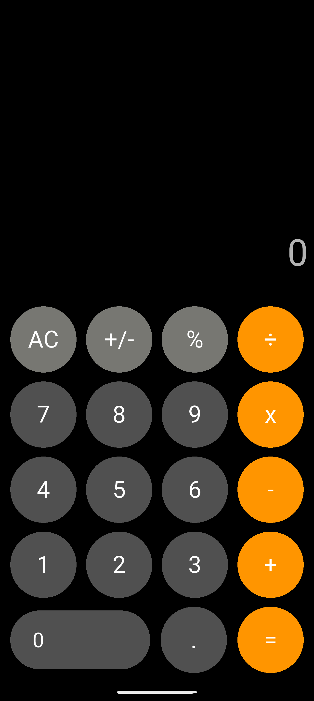

# 📱 Flutter Calculator App

A simple and elegant calculator application built using Flutter. This app performs basic arithmetic operations and includes support for percentage calculations and formatted decimal results.

![Flutter Calculator Screenshot]


---

## ✨ Features

- Basic operations: Addition (`+`), Subtraction (`-`), Multiplication (`×`), Division (`÷`)
- Percentage (`%`) calculation
- Supports decimal numbers (`.`)
- Expression display before result
- Error handling for division by zero
- Smart output formatting:
  - Shows integer if result is whole
  - Shows up to **7 decimal places** for fractional results
- Clear All (`AC`) functionality

---

## 🔧 Technologies Used

- **Flutter** (Dart)
- Stateless and Stateful Widgets
- Custom logic for expression parsing and formatting

---

## 📦 Installation & Running Locally

1. **Clone the repository**

```bash
git clone https://github.com/asifriyad6/iPhone-Calculator-Flutter.git
cd flutter-calculator
